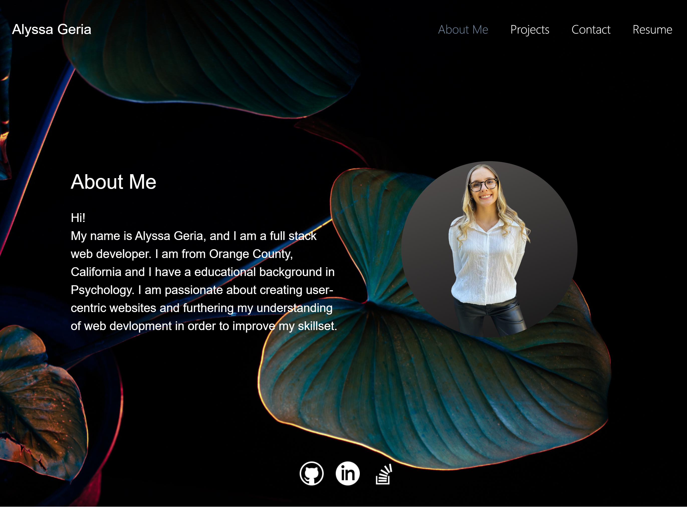

# React Portfolio

## Description
The purpose and motivation behind this project was to create a portfolio with an about me section, a list of some of my projects, a contact form and my resume.
## Table of Contents
- [Installation](#installation)
- [Usage](#usage)
- [Contribution](#contribution)
## Installation
The dependencies for this application are react.

## Usage
This is a functional front-end application where you are able to use the navbar to render different pages. The items on the navbar will change color when you are rendering the page. The projects page will have 6 of my projects with links to github and the website, the contact page will have a form that has required fields, the resume section will have a downloadable link to my resume and the footer has links to my github, linkedin and stack overflow.

## Contribution
N/A

## Tests
N/A

## Questions
If you have any questions my github is [alyssageria](https://github.com/alyssageria/) and you can contact me at alyssageria@gmail.com.

;
